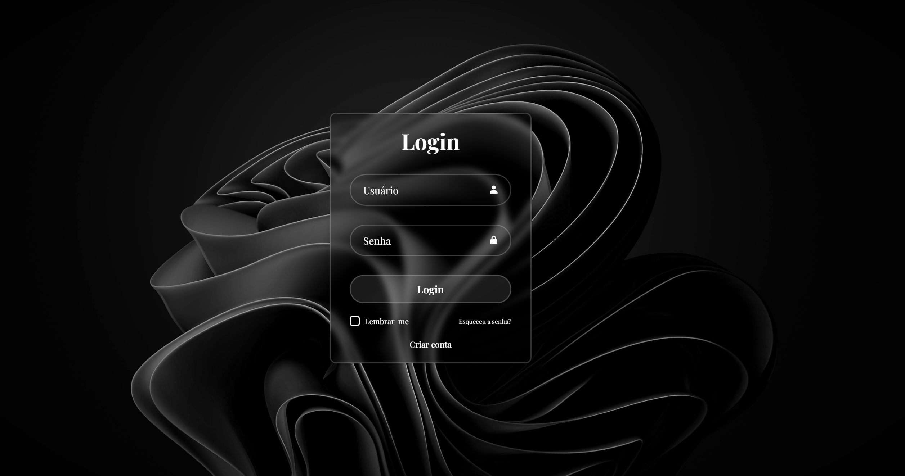

# 🔐 Modern Login Page - HTML & CSS

This project is a responsive and visually appealing login interface built with HTML5 and CSS3. It features a modern glassmorphism design, clean layout, and smooth UI elements using only frontend technologies.

---

## 🖼️ Website Preview



---

## 📚 Features

- 👤 **User login form** with email and password inputs  
- 🧊 **Glassmorphism design** with translucent background and blur effect  
- 🎨 **Stylized interface** with custom fonts, icons (Boxicons), and hover animations  
- 🔐 **"Remember me" checkbox** and account recovery/create links  
- 🖼️ **Background image** with flexible layout using Flexbox  

---

## 🧠 Technologies Used

- HTML5  
- CSS3  
- Google Fonts (`Playfair Display`)  
- Boxicons (icon library)  
- Responsive layout using `flexbox`  
- Visual effects using `backdrop-filter` and `box-shadow`  

---

## 📁 File Structure

| File/Folder       | Description                            |
|-------------------|----------------------------------------|
| `index.html`      | Main HTML structure                    |
| `styles.css`      | Full interface styling and effects     |
| `img/fundo.png`   | Background image for page              |

---

## 🚀 How to Run

1. Clone or download the repository  
2. Open `index.html` in your browser  

```bash
git clone https://github.com/your-user/modern-login-page.git
cd modern-login-page
start index.html
```

---

## 👨‍💻 Autor
**Domingues**

[GitHub](https://github.com/akdomingues) · [LinkedIn](www.linkedin.com/in/dominguescaua) · [Instagram](https://www.instagram.com/exe.domingues/)  
